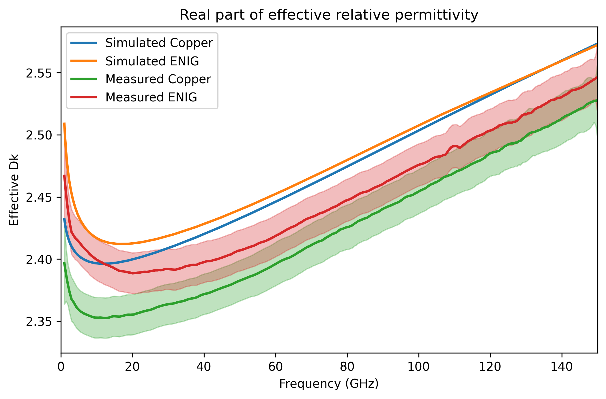
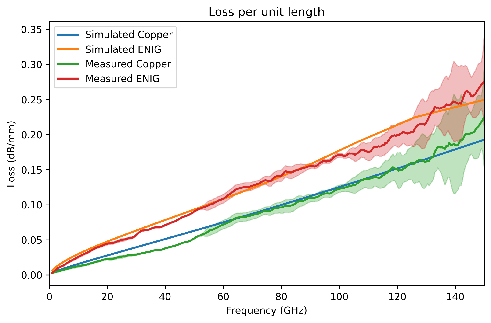
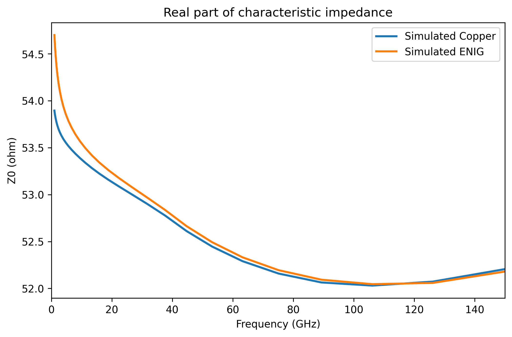
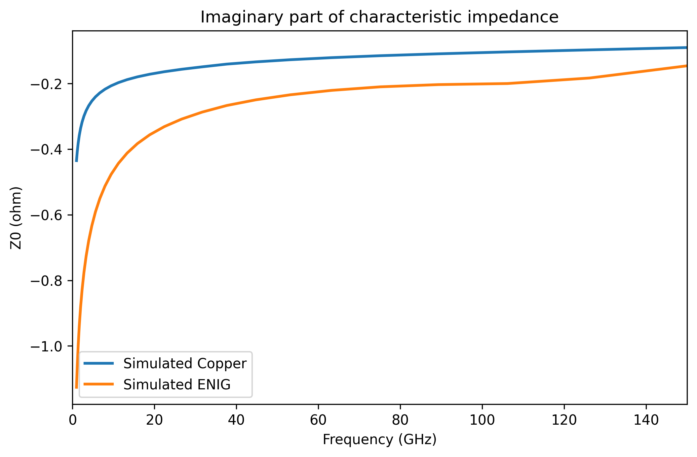

# Python 2D Transmission Line Simulation with HFSS

This is something I have wanted to do for a while... still a work in progress. The goal is to automatically simulate typical transmission lines and get the 2D parameters, i.e. characteristic impedance and propagation constant, from which RLGC parameters could then be calculated.

BTW, if anyone has already done something similar, please get in touch!

## Installation

There is no installation. Just run the code provided in the repository. You need to install [`pyaedt`](https://github.com/ansys/pyaedt). Of course, you also need Ansys Electronics Desktop (EDT) installed, e.g., <https://www.ansys.com/academic/students/ansys-electronics-desktop-student>

```cmd
  python -m pip install pyaedt -U
```

Also, you need other basic scientific packages, such as Numpy. Check each file for the used packages.

__NOTE:__ [`pyaedt`](https://github.com/ansys/pyaedt) package is constantly being updated, and I wouldn't be surprised if some of the commands get deprecated. So, it is what it is 😒

## How to use

You only need to import the simulation script in your main script, which all should be in the same folder. See the included examples for details.

```Python
import numpy as np
from hfss_ms import HFSSMS   # my code, need to be in same folder as this script

# frequency grid
f = np.logspace(-1, 2, 30, base=10)*1e9

# microstrip dimensions    
h = 0.127e-3
t = 0.02e-3
w = 0.284e-3
wgnd = 5e-3

# dielectric properties
er = 2.91
etand = 0.0017

# Conductor properties 
# top gnd and bottom sig are rough
conductor_gnd_top = [ {'sigma': 58e6, 'mur': 0.999991, 'Rrms': 1e-6, 'boundary_loc': 0, 'distribution': 'norm'} ]
conductor_sig_bottom = [ {'sigma': 58e6, 'mur': 0.999991, 'Rrms': 1e-6, 'boundary_loc': 0, 'distribution': 'norm'} ]

# top and side of sig are platted (here not, hence only copper listed)
conductor_sig_top = [ {'sigma': 58e6, 'mur': 0.999991, 'Rrms': 50e-9, 'boundary_loc': 0, 'distribution': 'norm'} ]
conductor_sig_side = conductor_sig_top

# define the class
ms = HFSSMS(f, w, h, t, wgnd, er=er, etand=etand, conductor_gnd_top=conductor_gnd_top,
            conductor_sig_top=conductor_sig_top, conductor_sig_bottom=conductor_sig_bottom,
            conductor_sig_side=conductor_sig_side)

# run the simulation headless and close after finish
hfss = ms.run_simulation(closs_aedt_at_finish=True, headless=True, port_accuracy=0.001)

Z0 = ms.Z0       # solved characteristic impedance
gamma = ms.gamma  # solved propagation constant
```

## Microstrip example

See the code in [`example_microstrip.py`](https://github.com/ZiadHatab/hfss-2d-transmission-line-simulation/blob/main/example_microstrip.py). The example simulates a microstrip line in two conditions, one as bare copper, and second with ENIG coating. The measurements compared against are from the paper [1]. The material parameters I used for the simulation are not the most accurate, I just retrofitted them a bit to match the measurements.

The ENIG coating and roughness were incorporated in the simulation through calculation of surface impedance with the script [`surfz.py`](https://github.com/ZiadHatab/hfss-2d-transmission-line-simulation/blob/main/surfz.py) (check the main repository for details: <https://github.com/ZiadHatab/rough-surface-impedance>).

 | 
:--: | :--:

 | 
:--: | :--:

## References

[1] B. Schafsteller, M. Schwaemmlein, M. Rosin, G. Ramos, Z. Hatab, M. E. Gadringer, E. Schlaffer, "Investigating the Impact of Final Finishes on the Insertion Loss in As Received and After Aging," IMAPSource Proceedings, vol. 2023, no. Symposium. IMAPS - International Microelectronics Assembly and Packaging Society, Feb. 29, 2024. doi: [10.4071/001c.94519](https://doi.org/10.4071/001c.94519).

## License

[](https://choosealicense.com/licenses/mit/)
